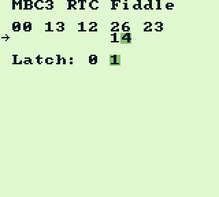

# MBC3 RTC Fiddle

This is a simple Game Boy ROM that lets you play around with the Real Time Clock
registers, originally developed to debug the implementation used by the EZ Flash Junior.

You can grab a ROM [on the releases tab](https://github.com/NieDzejkob/mbc3-fiddle/releases).

## Functionality

At the top, the current values of the RTC registers are shown, starting with
`DAY_HIGH ($0C)` on the left. They are updated every frame (which means the
bank select register is cycled 60 times a second), but by default you have to
latch the registers manually.

SELECT toggles between writing values and latching the registers (indicated by
the arrow on the left).

When writing values:

 - UP/DOWN to change the value
 - LEFT/RIGHT to change the address and the digit you're modifying
 - A to write the byte

When latching:

 - LEFT to write a 0
 - RIGHT to write a 1
 - START to switch to automatic latching. It will get disabled once you press
   LEFT or RIGHT again.

The value last written to the latch register is highlighted.
